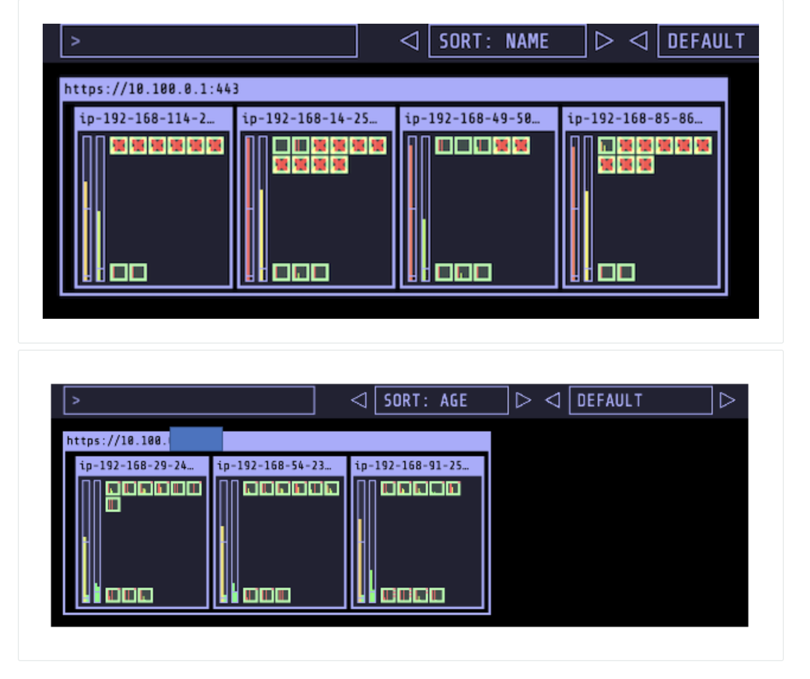

# 使用Karpenter进行高效弹性伸缩
karpenter是开源的k8s集群弹性伸缩服务，提供秒级的计算资源与应用匹配，在创建pod时，以最小延迟将node资源进行调度分配；其主要功能如下：

- 观察被Kubernetes调度器标记为不可调度的pods
- 评估pod请求的调度约束（资源请求、节点选择器、亲和力、容忍度和拓扑扩散约束）
- 提供符合pods要求的节点
- 安排pod在新节点上运行
- 当不再需要这些节点时，移除这些节点

## 安装Karpenter前的准备工作
### 保存环境变量
```
export CLUSTER_NAME=$(eksctl get clusters -o json | jq -r '.[0].Name')
export ACCOUNT_ID=$(aws sts get-caller-identity --output text --query Account)
export AWS_REGION=$(curl -s 169.254.169.254/latest/dynamic/instance-identity/document | jq -r '.region')
echo $CLUSTER_NAME
echo $ACCOUNT_ID
echo $AWS_REGION
```

### 给子网打标签
Karpenter能够发现标记为 kubernetes.io/cluster/$CLUSTER_NAME 的子网。 因此我们需要将此标记添加到子网。 以下命令从 cloudformation 中检索子网 ID，并使用适当的集群名称对其进行标记。
```
SUBNET_IDS=$(aws cloudformation describe-stacks \
    --stack-name eksctl-${CLUSTER_NAME}-cluster \
    --query 'Stacks[].Outputs[?OutputKey==`SubnetsPublic`].OutputValue' \
    --output text)
aws ec2 create-tags \
    --resources $(echo $SUBNET_IDS | tr ',' '\n') \
    --tags Key="kubernetes.io/cluster/${CLUSTER_NAME}",Value=
```

### 创建karpenter节点的IAM Role和InstanceProfile
Karpenter启动的实例使用 InstanceProfile 运行，InstanceProfile包含了运行容器和配置网络所需的权限。 Karpenter使用的InstanceProfile名称为：KarpenterNodeRole-${ClusterName}. 
```
export KARPENTER_VERSION=v0.16.0
TEMPOUT=$(mktemp)
curl -fsSL https://karpenter.sh/"${KARPENTER_VERSION}"/getting-started/getting-started-with-eksctl/cloudformation.yaml  > $TEMPOUT \
&& aws cloudformation deploy \
  --stack-name "Karpenter-${CLUSTER_NAME}" \
  --template-file "${TEMPOUT}" \
  --capabilities CAPABILITY_NAMED_IAM \
  --parameter-overrides "ClusterName=${CLUSTER_NAME}"
```

上面这一步需要两分钟左右完成。


### 给实例授权使其可以用创建的InstanceProfile来连接EKS集群。
```
eksctl create iamidentitymapping \
  --username system:node:{{EC2PrivateDNSName}} \
  --cluster  ${CLUSTER_NAME} \
  --arn arn:aws:iam::${ACCOUNT_ID}:role/KarpenterNodeRole-${CLUSTER_NAME} \
  --group system:bootstrappers \
  --group system:nodes
```


### 创建 KarpenterController IAM 角色

创建IAM OIDC Identity Provider for the cluster 
```
eksctl utils associate-iam-oidc-provider --cluster ${CLUSTER_NAME} --approve
```
创建 IAM Role, Kubernetes service account, 并使用 IAM Roles for Service Accounts (IRSA)
```
eksctl create iamserviceaccount \
  --cluster $CLUSTER_NAME --name karpenter --namespace karpenter \
  --role-name "${CLUSTER_NAME}-karpenter" \
  --attach-policy-arn arn:aws:iam::$ACCOUNT_ID:policy/KarpenterControllerPolicy-$CLUSTER_NAME \
  --approve
export KARPENTER_IAM_ROLE_ARN="arn:aws:iam::${ACCOUNT_ID}:role/${CLUSTER_NAME}-karpenter"
```

等待大约两分钟。检查service account：

```
kubectl get serviceaccounts --namespace karpenter
```
输出显示：

```
NAME        SECRETS   AGE
default     1         44s
karpenter   1         44s
```

## 安装Karpenter
我们将用Helm来安装 Karpenter 并配置默认的 Provisioner CRD。 Karpenter 的配置遵循 kubernetes 控制器的最佳实践。 Karpenter 使用Custom Resource Definition(CRD) 来声明配置。
```
export KARPENTER_VERSION=v0.16.0
helm repo add karpenter https://charts.karpenter.sh
helm repo update
helm upgrade --install --namespace karpenter \
  karpenter karpenter/karpenter \
  --version ${KARPENTER_VERSION} \
  --set serviceAccount.create=false \
  --set serviceAccount.name=karpenter \
  --set clusterName=${CLUSTER_NAME} \
  --set clusterEndpoint=$(aws eks describe-cluster --name ${CLUSTER_NAME} --query "cluster.endpoint" --output text) \
  --set aws.defaultInstanceProfile=KarpenterNodeInstanceProfile-${CLUSTER_NAME} \
  --wait
```

安装完成后，检查Karpenter的deployment：
```
kubectl get deployment -n karpenter
```
```
NAME        READY   UP-TO-DATE   AVAILABLE   AGE
karpenter   2/2     2            2           4m27s
```


## 设置 Provisioner
Provisioner 定义了 Karpenter 如何管理尚未调度的 Pod。 Karpenter 可以根据 Pod 的 labels 和 affinity 等属性做出调度和配置决策。Karpenter 的主要目标是简化容量管理。 如果您熟悉Cluster Autoscalor，您会注意到 Karpenter 采用了一种不同的方法，Karpenter 不扩展 AutoscalingGroups (ASG)，它直接扩展EC2实例。 Karpenter 可以更高效快速地添加EC2节点来处理尚未调度的 Pod，并在不需要时移除节点。

### 设置默认的 CRD Provisioner
```
cat <<EOF | kubectl apply -f -
apiVersion: karpenter.sh/v1alpha5
kind: Provisioner
metadata:
  name: default
spec:
  requirements:
    - key: "node.kubernetes.io/instance-type" 
      operator: In
      values: ["m5.large", "m5.2xlarge"]
  provider:
    subnetSelector:
      alpha.eksctl.io/cluster-name: ${CLUSTER_NAME}
    securityGroupSelector:
      alpha.eksctl.io/cluster-name: ${CLUSTER_NAME}
  ttlSecondsAfterEmpty: 30
  limits:
    resources:
      cpu: "20"
  labels:
    billing-team: my-team     
EOF
```

### 创建Spot的service linked role

```
aws iam create-service-linked-role --aws-service-name spot.amazonaws.com
```

## 测试Karpenter的高效扩容
现在我们来将proddetail副本的数量增加到25
```
kubectl scale --replicas=25 deployment/proddetail -n workshop
```

在cloud9环境新建一个terminal来观察pod的创建情况
```
kubectl get pods -l app=proddetail -n workshop -o wide --watch
```
显示如下：
```
proddetail-745889bdf7-s9fxk   1/1     Running   0          8m10s   192.168.86.50   ip-192-168-91-zzz.us-west-2.compute.internal   <none>           <none>
proddetail-745889bdf7-5vw7m   0/1     Pending   0          0s      <none>          <none>                                         <none>           <none>
proddetail-745889bdf7-5vw7m   0/1     Pending   0          0s      <none>          ip-192-168-5-xxx.us-west-2.compute.internal    <none>           <none>
proddetail-745889bdf7-fl8jv   0/1     Pending   0          0s      <none>          <none>                                         <none>           <none>
proddetail-745889bdf7-tpmwm   0/1     Pending   0          0s      <none>          <none>                                         <none>           <none>
proddetail-745889bdf7-5vw7m   0/1     ContainerCreating   0          0s      <none>          ip-192-168-5-xxx.us-west-2.compute.internal    <none>           <none>
proddetail-745889bdf7-fl8jv   0/1     Pending             0          0s      <none>          ip-192-168-53-yyy.us-west-2.compute.internal    <none>           <none>
proddetail-745889bdf7-tpmwm   0/1     Pending             0          0s      <none>          ip-192-168-5-xxx.us-west-2.compute.internal    <none>           <none>
proddetail-745889bdf7-fl8jv   0/1     ContainerCreating   0          0s      <none>          ip-192-168-53-yyy.us-west-2.compute.internal    <none>           <none>
proddetail-745889bdf7-tpmwm   0/1     ContainerCreating   0          0s      <none>          ip-192-168-5-xxx.us-west-2.compute.internal    <none>           <none>
proddetail-745889bdf7-nhm8t   0/1     Pending             0          0s      <none>          <none>                                         <none>           <none>
proddetail-745889bdf7-872nz   0/1     Pending             0          0s      <none>          <none>    
```

等pod都创建好了，可以观察到node数量也增加了
```
kgn
```
```
NAME                                            STATUS   ROLES    AGE     VERSION                ARCH    CAPACITYTYPE   INSTANCE-TYPE   NODEGROUP   ZONE         PROVISIONER-NAME   CAPACITY-TYPE
ip-192-168-101-250.us-east-2.compute.internal   Ready    <none>   9m15s   v1.21.14-eks-ba74326   amd64                  m5.2xlarge                  us-east-2a   default            spot
ip-192-168-29-189.us-east-2.compute.internal    Ready    <none>   44m     v1.21.14-eks-ba74326   amd64   ON_DEMAND      m5.large        workshop    us-east-2a                      
ip-192-168-38-225.us-east-2.compute.internal    Ready    <none>   44m     v1.21.14-eks-ba74326   amd64   ON_DEMAND      m5.large        workshop    us-east-2b                      
ip-192-168-78-168.us-east-2.compute.internal    Ready    <none>   44m     v1.21.14-eks-ba74326   amd64   ON_DEMAND      m5.large        workshop    us-east-2c
```

还可以去kube-ops-view，观察pod的分布情况

## 测试Karpenter的缩容
将副本数量减为1:
```
kubectl scale --replicas=1 deployment/proddetail -n workshop
```
少许等待，观察节点数量从4减为3:
```
kgn
```
```
AME                                            STATUS   ROLES    AGE    VERSION                ARCH    CAPACITYTYPE   INSTANCE-TYPE   NODEGROUP   ZONE         PROVISIONER-NAME   CAPACITY-TYPE
ip-192-168-112-54.us-east-2.compute.internal    Ready    <none>   100m   v1.21.14-eks-fb459a0   amd64   ON_DEMAND      t3.small        nodegroup   us-east-2a                      
ip-192-168-154-207.us-east-2.compute.internal   Ready    <none>   100m   v1.21.14-eks-fb459a0   amd64   ON_DEMAND      t3.small        nodegroup   us-east-2b                      
ip-192-168-182-215.us-east-2.compute.internal   Ready    <none>   100m   v1.21.14-eks-fb459a0   amd64   ON_DEMAND      t3.small        nodegroup   us-east-2c                       
```

在Kube-ops-view也可以看到节点数和pod的减少：


## 删除Karpenter的资源
当不再需要Karpenter环境了，我们可以按照以下命令清除Karpenter和相关的资源
```
helm uninstall karpenter --namespace karpenter
eksctl delete iamserviceaccount --cluster ${CLUSTER_NAME} --name karpenter --namespace karpenter
aws cloudformation delete-stack --stack-name Karpenter-${CLUSTER_NAME}
aws ec2 describe-launch-templates \
    | jq -r ".LaunchTemplates[].LaunchTemplateName" \
    | grep -i Karpenter-${CLUSTER_NAME} \
    | xargs -I{} aws ec2 delete-launch-template --launch-template-name {}

kubectl delete ns karpenter 
kubectl delete provisioners.karpenter.sh default
```


