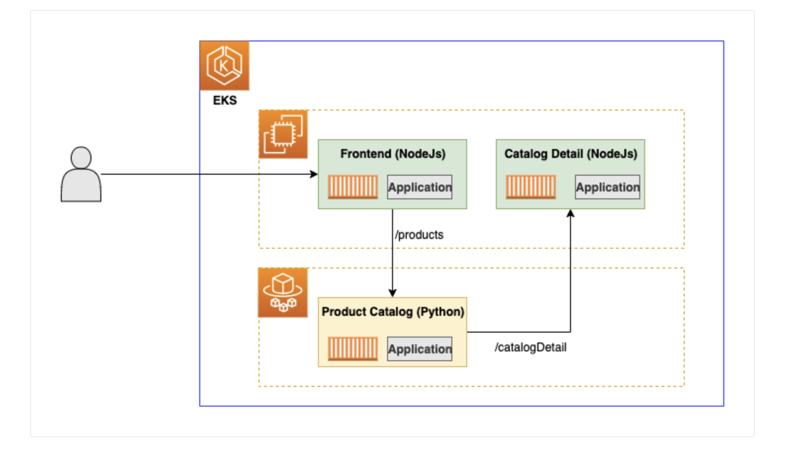

AWS Fargate 是一种为容器提供按需的计算能力的技术。 借助 AWS Fargate，您无需自行预置、配置或扩展虚拟机组即可运行容器。 您也不需要选择服务器类型、决定何时扩展节点组。 您可以控制哪些 pod 在 Fargate 上启动以及它们如何使用 Fargate Profile 来运行。 Fargate Profile 是您的 Amazon EKS 集群的一部分。
Fargate 的优势：

- AWS Fargate 使您能够专注于您的应用程序。 您定义应用程序内容、网络、存储和扩展要求。 无需配置、修补、集群容量管理或基础设施管理。
- AWS Fargate 支持所有常见的容器用例，包括微服务架构应用程序、批处理、机器学习应用程序以及将本地应用程序迁移到云端。
- 选择 AWS Fargate 是因为它的隔离模型和安全性。 如果您想启动容器而无需配置或管理 EC2 实例，您应该选择 Fargate。 如果您需要更多地控制 EC2 实例或更广泛的自定义选项，请使用传统的基于 EC2 的 ECS 或 EKS。

我们将 Product Catalog 的后端微服务部署在 AWS Fargate 上的，其他两个微服务 Frontend 和 Catalog Detail 仍然留在EC2托管节点组上，来展示在同一集群中混合使用 fargate 和托管节点组的微服务之间的通信：



## 创建Fargate Profile
Fargate Profile 允许管理员声明哪些 pod 在 Fargate 上运行。 每个配置文件最多可以有五个包含 namespace 和可选 label 的 selector。与selector 匹配的 Pod 会在 Fargate 上进行调度。

用文本编辑器创建一个clusterconfig.yaml
```
--
apiVersion: eksctl.io/v1alpha5
kind: ClusterConfig

metadata:
  name: eksworkshop-eksctl
  region: ${AWS_REGION}

fargateProfiles:
  - name: fargate-productcatalog
    selectors:
      - namespace: workshop
        labels:
          app: prodcatalog
```

创建Fargate Profile
```
envsubst < ./clusterconfig.yaml | eksctl create fargateprofile -f -
```
这一步可能需要5-7分钟，请等待完成


删除之前部署在 EC2 的 prodcatalog
```
kubectl delete deploy prodcatalog -n workshop
```
重新部署 prodcatalog
```
cd ~/environment/eks-app-mesh-polyglot-demo
helm upgrade workshop ~/environment/eks-app-mesh-polyglot-demo/workshop/helm-chart/
```

观察 prodcatalog 部署的 node 已经是 Fargate了：
```
kubectl get pods -n workshop -o wide
```
```
NAME                           READY   STATUS    RESTARTS   AGE     IP                NODE                                                    NOMINATED NODE   READINESS GATES
frontend-695f9f586f-xxxxx      1/1     Running   0          17d     192.168.XX.XX     ip-192-168-XX-XX.us-west-2.compute.internal             <none>           <none>
prodcatalog-6cc8ff6db9-xxxxx   1/1     Running   0          4m17s   192.168.XX.XX   fargate-ip-192-168-XX-XX.us-west-2.compute.internal   <none>           <none>
proddetail-6dbddf7fd7-xxxxx    1/1     Running   0          45h     192.168.XX.XX    ip-192-168-XX-XX.us-west-2.compute.internal             <none>           <none>
```


## 测试应用
获取负载均衡器的地址：
```
export LB_NAME=$(kubectl get svc frontend -n workshop -o jsonpath="{.status.loadBalancer.ingress[*].hostname}") 
echo $LB_NAME
```

在浏览器打开返回的负载均衡器的地址，可以访问，并显示如下：


