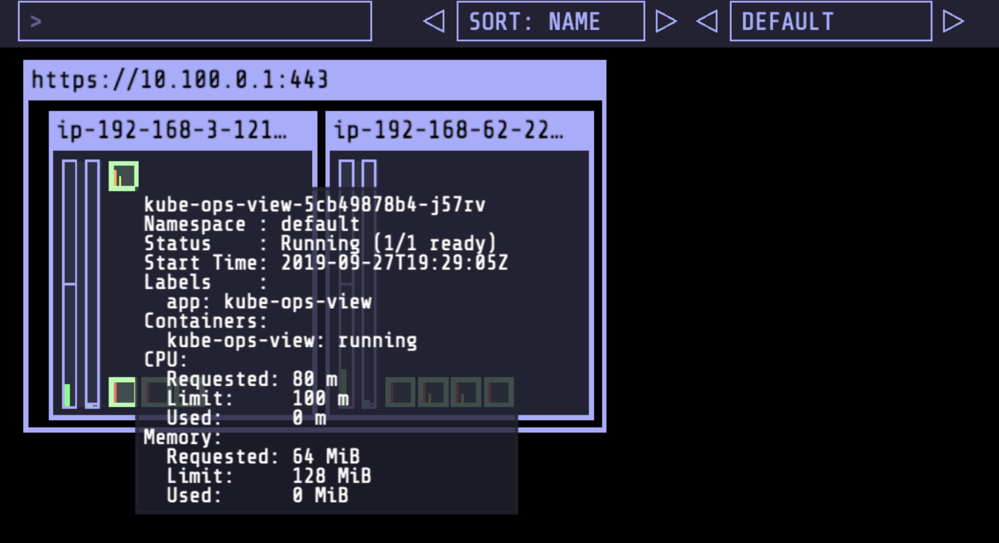

# 部署应用
## 使用Helm安装应用

```
cd ~/environment/eks-app-mesh-polyglot-demo
helm install workshop ~/environment/eks-app-mesh-polyglot-demo/workshop/helm-chart/
```


确认应用已经部署好，执行以下命令：
```
kubectl get pod,svc -n workshop -o wide
```

应该输出
```
NAME                              READY   STATUS    RESTARTS   AGE   IP               NODE                                           NOMINATED NODE   READINESS GATES
pod/frontend-6b698489df-xxxxx     1/1     Running   0          50s   192.xxxxx.46.yy    ip-192-168-53-83.us-west-2.compute.internal    <none>           <none>
pod/prodcatalog-95df774d4-xxxxx   1/1     Running   0          50s   192.xxxxx.56.yy    ip-192-168-53-83.us-west-2.compute.internal    <none>           <none>
pod/proddetail-7b78f4b59f-xxxxx   1/1     Running   0          50s   192.xxxxx.86.yy   ip-192-168-91-255.us-west-2.compute.internal   <none>           <none>

NAME                  TYPE           CLUSTER-IP       EXTERNAL-IP                                                              PORT(S)          AGE   SELECTOR
service/frontend      LoadBalancer   10.xxxxx.146.yy    a062a547856a14dd48c798033c8b7dd9-xxxxxxx.us-west-2.elb.amazonaws.com   80:31697/TCP   51s   app=frontend
service/prodcatalog   ClusterIP      10.xxxxx.103.yy   <none>                                                                   5000/TCP         51s   app=prodcatalog
service/proddetail    ClusterIP      10.xxxxx.54.yy    <none>                                                                   3000/TCP         51s   app=proddetail
```

得到负载均衡的地址，执行：
```
export LB_NAME=$(kubectl get svc frontend -n workshop -o jsonpath="{.status.loadBalancer.ingress[*].hostname}") 
echo $LB_NAME
```

在浏览器里输入上面命令返回的负载均衡器地址，应用就可以访问啦！
  

## 安装Kube-ops-view方便观察容器扩容
Kube-ops-view有助于将K8s集群可视化，方便我们观察后续的容器扩展。我们再次使用 Helm 部署 kube-ops-view。

```
helm repo add stable https://charts.helm.sh/stable
helm install kube-ops-view \
stable/kube-ops-view \
--set service.type=LoadBalancer \
--set rbac.create=True
```

确认Helm Chart正确安装：
```
helm list
```

应该显示：
```
NAME            REVISION        UPDATED                         STATUS          CHART                   APP VERSION     NAMESPACE
kube-ops-view   1               Sun Sep 22 11:47:31 2019        DEPLOYED        kube-ops-view-1.1.0     0.11            default  
```

稍等两三分钟等负载均衡器启动，执行以下命令获得负载均衡器的地址并在浏览器里用另一个页面打开：
```
kubectl get svc kube-ops-view | tail -n 1 | awk '{ print "Kube-ops-view URL = http://"$4 }'
```
kube-ops-view 显示的集群信息应该类似下图：



